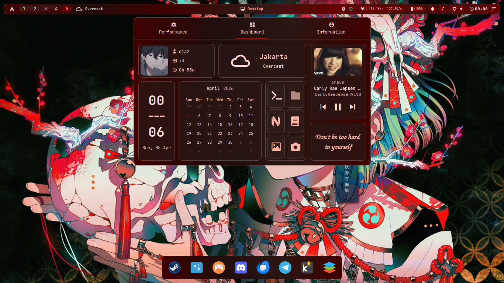
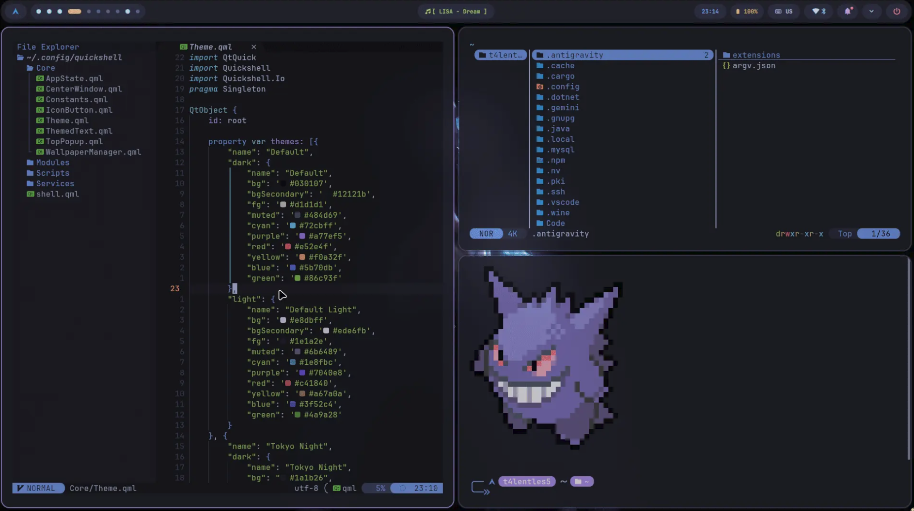
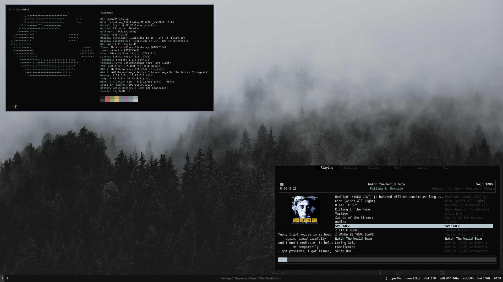
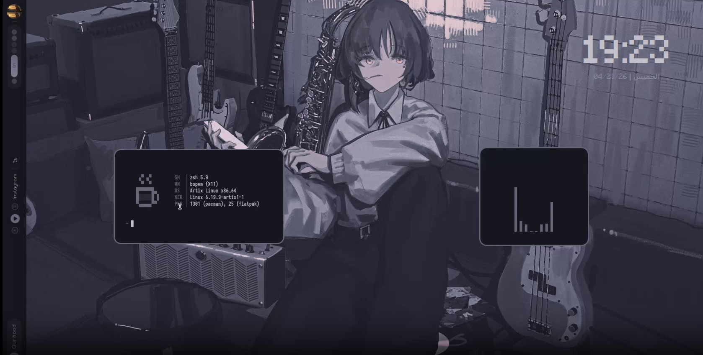

# linux/unix rices

A community collection of linux/unix desktop setups - curated and featured on [YouTube](https://www.youtube.com/@xpltt).

Want to be featured? Read [CONTRIBUTING.md](CONTRIBUTING.md) and open a pull request.

---

## setups

| preview | author | wm / de | distro | video | dotfiles |
|---------|--------|---------|--------|-------|----------|
|  | [MDiaznf23](rices/MDiaznf23/info.md) | i3 | CachyOS | - | [dotfiles](https://github.com/MDiaznf23/simple-autoricing-i3wm-dotfiles) |
|  | [bibjaw99](rices/bibjaw99/info.md) | sway | sway | [▶ watch](https://www.youtube.com/watch?v=-mbwweMYxtA) | [dotfiles](https://codeberg.org/bibjaw99/grimmstation) |
|  | [caelestia-dots](rices/caelestia-dots/info.md) | hyprland | arch/deb | [▶ watch](https://www.youtube.com/watch?v=VdUJHSdDhDE) | [dotfiles](https://github.com/caelestia-dots/caelestia) |
|  | [caioax](rices/caioax/info.md) | hyprland | arch | [▶ watch](https://www.youtube.com/watch?v=olWHg1U6jOU) | [dotfiles](https://github.com/caioax/lyne-dots) |
|  | [despcodr](rices/despcodr/info.md) | hyprland | nix and arch | [▶ watch](https://www.youtube.com/watch?v=rJYXSyZNfhk) | [dotfiles](https://github.com/despcodr/hyprland-dots/) |
|  | [end-4](rices/end-4/info.md) | hyprland | arch | [▶ watch](https://www.youtube.com/watch?v=n3u0VdwsB4Q) | github.com/jahamars/wayland |
|  | [Zorax-Dev](rices/hyprkai/info.md) | hyprland | arch | [▶ watch](https://www.youtube.com/watch?v=hPwJi2WU9e4) | [dotfiles](https://github.com/Zorax-Dev/Hyprkai) |
|  | [jahamars](rices/jahongir/info.md) | sway | arch | [▶ watch](https://www.youtube.com/watch?v=lcUVSfVEo6o) | github.com/jahamars/wayland |
|  | [kando](rices/kando/info.md) | hyprland | debian | [▶ watch](https://www.youtube.com/watch?v=DqFiUhQi_B4) | [dotfiles](https://kando.menu/) |
|  | [t4lentles5](rices/t4lentles5/info.md) | hyprland | arch | [▶ watch](https://www.youtube.com/watch?v=ubPxOnw6fFQ) | [dotfiles](https://github.com/t4lentles5/t4lentles5-dots) |
|  | [vyrx-dev](rices/vyrx-dev/info.md) | sway | cachyOS | - | [dotfiles](https://github.com/vyrx-dev/dotfiles) |
|  | [jahamars](rices/w.nodots1/info.md) | bspwm | artix | [▶ watch](https://www.youtube.com/watch?v=NcRHjKHzNhw) | no dots yet |

---

*[↑ back to top](#linuxunix-rices)*
